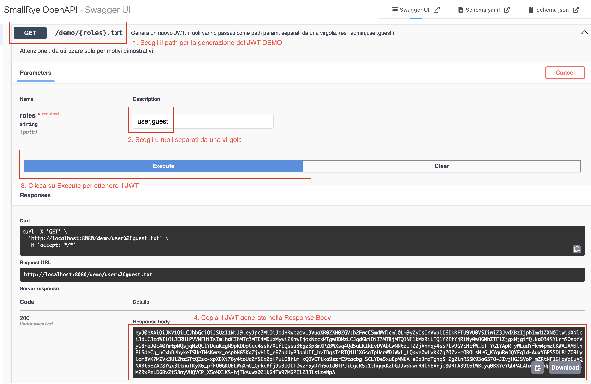
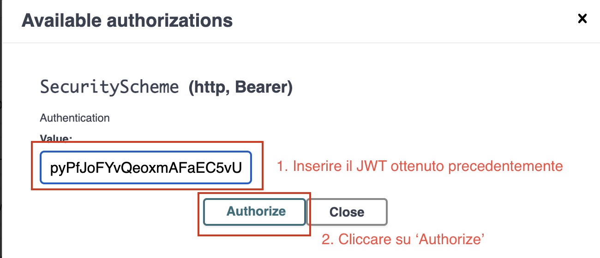
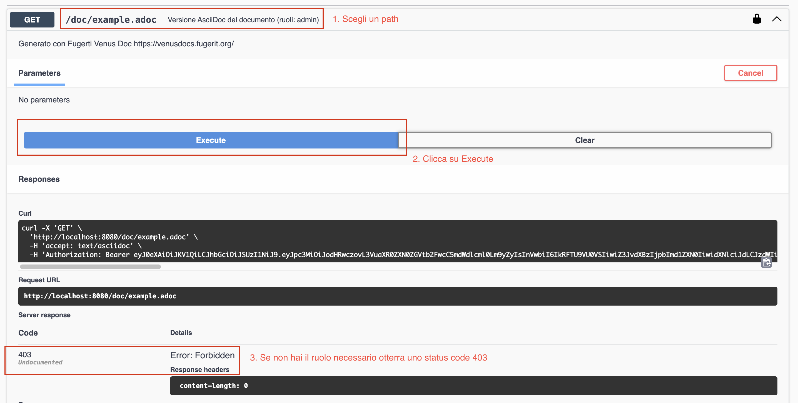
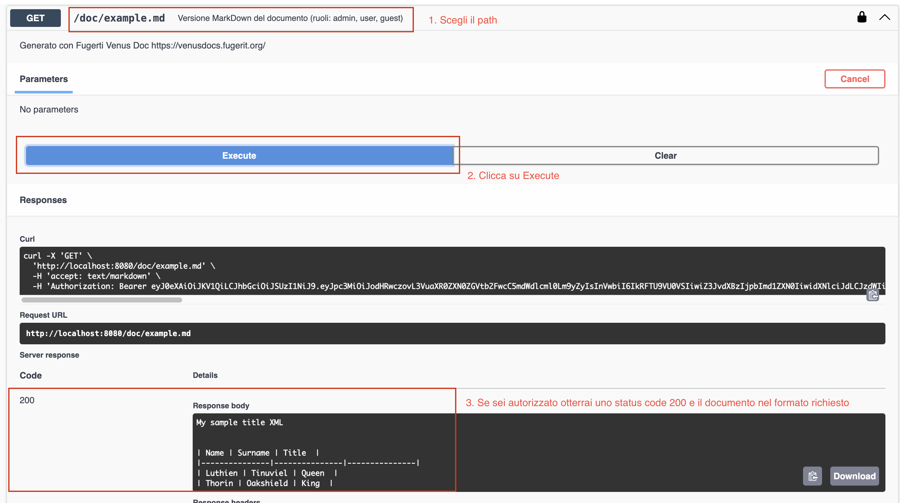

# unit-test-demo-app

L'obiettivo di questo progetto è di mostrare come è possibile usare dei tag degli unit test per cercare di garantire la verifica di aspetti specifici di una applicazione.

[](CHANGELOG.md)
[](https://sonarcloud.io/summary/new_code?id=fugerit79_unit-test-demo-app)
[](https://sonarcloud.io/summary/new_code?id=fugerit79_unit-test-demo-app)
[](https://opensource.org/licenses/MIT)
[](https://github.com/fugerit-org/fj-universe/blob/main/CODE_OF_CONDUCT.md)
[](https://github.com/fugerit79/unit-test-demo-app/actions/workflows/ci.yml)

## Indice

- [Il progetto](#il-progetto)
- [Architettura della sicurezza](#architettura-della-sicurezza)
- [Quickstart](#quickstart)
- [Note sugli unit test](#note-sugli-unit-test)
- [Security JUnit con tagging](#security-junit-con-tagging)
- [Troubleshooting](#troubleshooting)
- [Contribuire](#contribuire)
- [Licenza](#licenza)

## Il progetto

Questo progetto dimostra come implementare una strategia di testing basata su tag JUnit per garantire la copertura dei requisiti di sicurezza in un'applicazione Quarkus con autenticazione JWT e RBAC (Role-Based Access Control).

### Stack tecnologico

I principali componenti usati per questo progetto sono:

- [Quarkus - Uno stack cloud native e ottimizzato per OpenJDK HotSpot e GraalVM.](https://quarkus.io/)
- [junit5-tag-check-maven-plugin - Plugin Maven che permette di verificare che dei test con tag specifici siano stati eseguiti.](https://github.com/fugerit-org/junit5-tag-check-maven-plugin)
- [Fugerit Venus Doc - Un Framework per la generazione di documenti in vari formati (usato solo per le funzionalità dimostrative).](https://github.com/fugerit-org/fj-doc)

### Mappatura ruoli e permessi

L'applicazione è configurata per gestire 3 ruoli e 4 path, che generano lo stesso documento in formati diversi. Non tutti i ruoli sono autorizzati a generare ogni path. Ecco la mappa dei permessi:

| Path                | Output       | Ruoli autorizzati  |
|---------------------|--------------|-------------------|
| `/doc/example.md`   | 📝 MarkDown  | admin, user, guest |
| `/doc/example.adoc` | 📄 AsciiDoc  | admin              |
| `/doc/example.html` | 🌐 HTML      | admin, user        |
| `/doc/example.pdf`  | 📑 PDF       | admin              |

## Architettura della sicurezza

L'applicazione implementa un sistema di sicurezza a più livelli:

1. **Autenticazione JWT**: Verifica dell'identità tramite token firmati
2. **RBAC**: Controllo accessi basato su ruoli
3. **Test automatizzati**: Garanzia della copertura dei requisiti di sicurezza tramite tag JUnit

### Flusso di autenticazione

```
User → JWT Token → Quarkus Security → Role Check → Resource Access
```

## Quickstart

### Requisiti

* Maven 3.9.x
* Java 21+

### Verifica dell'applicazione

Per eseguire i test standard:

```shell
mvn verify
```

Per attivare anche la verifica dei tag di sicurezza con il plugin `junit5-tag-check-maven-plugin`:

```shell
mvn verify -P security
```

### Avvio dell'applicazione

```shell
mvn quarkus:dev
```

### Utilizzo dell'applicazione

1. Apri la [Swagger UI](http://localhost:8080/q/swagger-ui/)
2. Genera un JWT token (vedi sezione successiva)
3. Autorizza le richieste con il token
4. Testa gli endpoint disponibili

### Generazione e utilizzo dei JWT token

#### Generazione del token

Usa l'endpoint `/demo/{roles}.txt` per generare un JWT con i ruoli desiderati.

I ruoli disponibili sono:
- `admin` - Accesso completo a tutti i formati
- `user` - Accesso a MarkDown e HTML
- `guest` - Accesso solo a MarkDown

Esempio per generare un token con ruoli multipli (separati da virgola):
```
GET /demo/admin,user.txt
```

> ⚠️ **Nota importante**: L'endpoint `/demo/{roles}.txt` è fornito **solo per scopi dimostrativi**.
> In produzione, l'autenticazione deve avvenire tramite un Identity Provider (IDP) esterno.



#### Autorizzazione nella Swagger UI

1. Clicca sul pulsante **"Authorize"** nella Swagger UI
2. Inserisci il JWT ottenuto in precedenza nel formato: `Bearer <token>`
3. Clicca su "Authorize"



### Test: Accesso negato (403 Forbidden)

Se tenti di accedere a un endpoint senza i ruoli necessari, riceverai un errore 403.

**Esempio**: Tentativo di accesso a `/doc/example.adoc` senza ruolo `admin`



### Test: Accesso consentito (200 OK)

Con i ruoli appropriati, puoi accedere agli endpoint autorizzati.

**Esempio**: Accesso a `/doc/example.md` con ruoli `guest` o `user`



Vedi la [mappatura di ruoli e path](#mappatura-ruoli-e-permessi) per maggiori dettagli.

## Note sugli unit test

Le classi di test principali sono:

- [DocResourceTest](src/test/java/org/fugerit/java/demo/unittestdemoapp/DocResourceTest.java) - Testa i casi positivi
- [DocResourceSicurezzaTest](src/test/java/org/fugerit/java/demo/unittestdemoapp/DocResourceSicurezzaTest.java) - Test di sicurezza, in particolare gli accessi non autorizzati

## Security JUnit con tagging

### Strategia di testing

Il progetto utilizza un approccio basato su **tag JUnit** per garantire la copertura completa dei requisiti di sicurezza.

### Definizione dei tag di sicurezza

Definiamo i gruppi di test con cui vogliamo classificare i nostri test:

| Tag | Descrizione | Status Code atteso |
|-----|-------------|-------------------|
| `authorized` | Test per accessi autorizzati | 200, 201 |
| `unauthorized` | Test per utenti non autenticati (JWT mancante o non valido) | 401 |
| `forbidden` | Test per utenti autenticati senza i permessi necessari | 403 |
| `security` | Tag generico per qualsiasi altro controllo di sicurezza | vari |

### Esempio di test

Ecco un esempio di test con tag `forbidden`:

```java
@Test
@Tag("security")
@Tag("forbidden")
void testMarkdown403NoAdminRole() {
    String token = JwtGenerator.generateUserToken();
    given()
        .header("Authorization", "Bearer " + token)
        .when().get("/doc/example.adoc")
        .then().statusCode(Response.Status.FORBIDDEN.getStatusCode());
}
```

### Verifica presenza test

Ci sono vari modi per verificare la presenza di test sui tag definiti.

Per questa demo usiamo il più semplice, ovvero andremo a verificare con il [maven-surefire-plugin](https://maven.apache.org/surefire/maven-surefire-plugin/) che sia presente almeno un test per ogni tag.

Questo può essere fatto con una execution del plugin per ogni tag, es:

```xml
<execution>
    <id>verify-security-tests</id>
    <phase>test</phase>
    <goals>
        <goal>test</goal>
    </goals>
    <configuration>
        <groups>security</groups>
        <failIfNoTests>true</failIfNoTests>
    </configuration>
</execution>
```

Nel nostro caso attiviamo questo controllo con il profilo `security`:

```shell
mvn verify -P security
```

> **Nota**: È possibile usare questo meccanismo per verificare anche altri tag custom definiti dallo sviluppatore.

### Note su test e coverage

Un effetto collaterale dell'utilizzo del profilo `security` è che vengono eseguiti solo i test con i tag definiti.

Nella nostra CI per ovviare a questa situazione, abbiamo separato lo step di verifica da quello per il calcolo del quality gate e coverage:

```yaml
- name: Check security unit test tags
  run: mvn verify -P security
  
- name: Build and analyze
  env:
    SONAR_TOKEN: ${{ secrets.SONAR_TOKEN }}
  run: mvn -B clean install org.sonarsource.scanner.maven:sonar-maven-plugin:sonar -Dsonar.organization=fugerit79 -Dsonar.projectKey=fugerit79_unit-test-demo-app
```

> **Nota**: In futuro potremmo rendere più robusto il meccanismo, ad esempio con un sistema più personalizzabile di verifica (es. custom maven plugin).

## Troubleshooting

### Errore 401 Unauthorized

- Verifica che il token JWT sia stato generato correttamente
- Controlla che il token sia inserito nel formato `Bearer <token>`
- Verifica che il token non sia scaduto
- Assicurati che l'issuer del token corrisponda a quello configurato nell'applicazione

### Errore 403 Forbidden

- Controlla che l'utente abbia i ruoli necessari per l'endpoint richiesto
- Riferisciti alla [tabella dei permessi](#mappatura-ruoli-e-permessi) per verificare quali ruoli sono autorizzati
- Verifica che i ruoli siano stati correttamente inclusi nel JWT generato

### Build fallisce con profilo security

Verifica che tutti i tag richiesti siano coperti dai test:

```shell
mvn test -P security
```

Se mancano test per un tag specifico, il plugin `junit5-tag-check-maven-plugin` segnalerà l'errore con un messaggio chiaro.

### Problemi con la versione di Quarkus

Se riscontri errori di tipo `IllegalAccessError` o problemi con `ConfigMappingContext`, verifica:

1. Di utilizzare una versione stabile di Quarkus (attualmente 3.31.1)
2. Che il file `application.yaml` sia correttamente formattato
3. Di eseguire una pulizia completa: `mvn clean`

## Contribuire

Contributi sono benvenuti! Per favore:

1. Fork del repository
2. Crea un branch per la tua feature (`git checkout -b feature/AmazingFeature`)
3. Commit delle modifiche (`git commit -m 'Add some AmazingFeature'`)
4. Push al branch (`git push origin feature/AmazingFeature`)
5. Apri una Pull Request

Assicurati che:
- Tutti i test passino (`mvn verify`)
- I test di sicurezza siano coperti (`mvn verify -P security`)
- Il codice rispetti le convenzioni di formattazione del progetto

## Licenza

Questo progetto è rilasciato sotto licenza MIT - vedi il file [LICENSE](LICENSE) per i dettagli.
